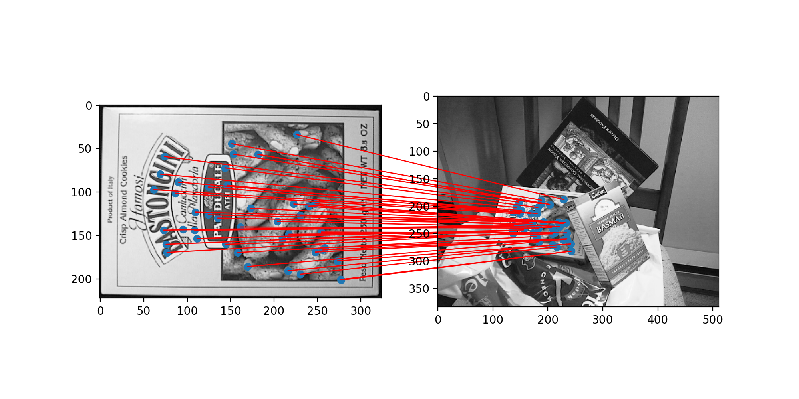
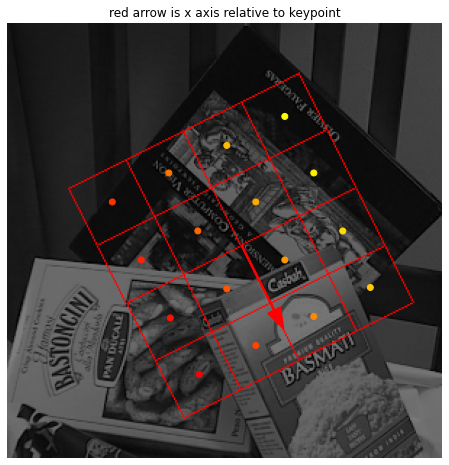
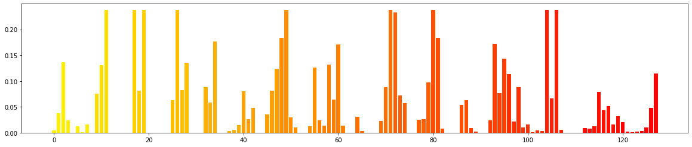

## SIFT
This repository contains a vectorized implementation of [Lowe's Scale Invariant Feature Transform](https://www.cs.ubc.ca/~lowe/papers/ijcv04.pdf). 
It is meant as an accessible and well-documented implementation that can be used as a study aid.
A central goal was to keep the code semantically consistent with the mental model a student may have of SIFT.
For example, the main feature detection loop uses high-level naming and hides implementation details.

```
gauss_octaves = build_gaussian_octaves(img)
for octave_idx, gauss_octave in enumerate(gauss_octaves):
    dog_octave = build_dog_octave(gauss_octave)
    extrema = find_dog_extrema(dog_octave)
    keypoint_coords = find_keypoints(extrema, dog_octave)
    keypoints = assign_reference_orientations(keypoint_coords, gauss_octave, octave_idx)
    keypoints = assign_descriptor(keypoints, gauss_octave, octave_idx)
```

## How to run
Install the requirements using `pip install -r requirements.txt`.      
Execute `python sift.py` to find and match features in `images/{box|box_in_scene}.png`. 

## Results
<p align="center">


</p>


## Notebooks
The notebooks provide a look into the intermediate steps of SIFT feature creation. See what each layer of a difference of gaussian (DoG) octave looks like; See how the vector fields of image gradients build a reference orientation; Or visualize the descriptor grid and the final histogram that is the SIFT feature. 
<p align="center">


</p> 

**Note:** The notebooks have been pushed with their state intact. One can view the visualization in Github by opening the notebook.
## File structure 
| Name                     | Purpose                                                                              |
|--------------------------|--------------------------------------------------------------------------------------|
| sift.py                  | Main function. Detects and plots matching SIFT features in two images.               |
| octaves.py               | Builds increasingly blurred Gaussian and DoG octaves.                                |
| keypoints.py             | Infers candidate keypoints from DoG octave extrema.                                  |
| reference_orientation.py | Assigns a reference orientation to a keypoint based on local gradients.              |
| descriptor.py            | Assigns a descriptor to a keypoint based on gradients in a large local neighborhood. |
| match.py                 | Performs brute-force matching of SIFT features between two images.                   |
| const.py                 | The parameters of the SIFT algorithm. These are set according to the literature.     |

